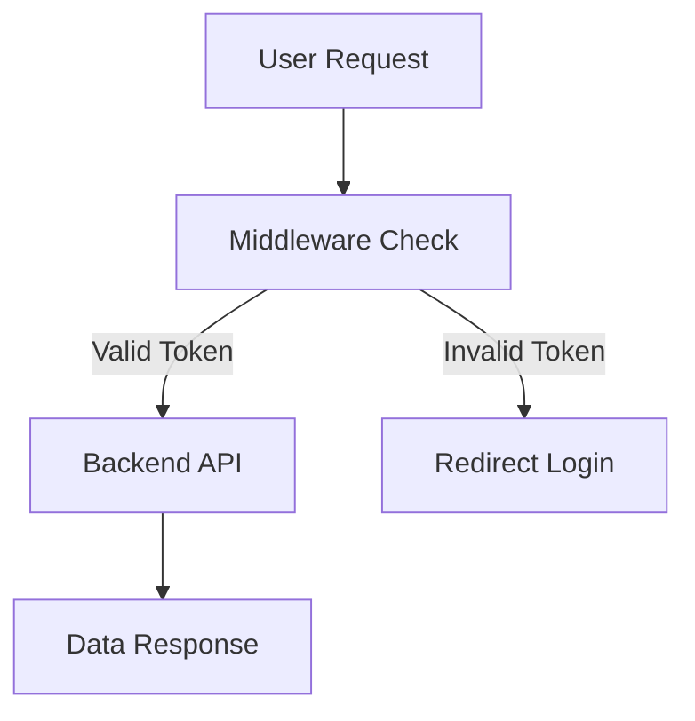
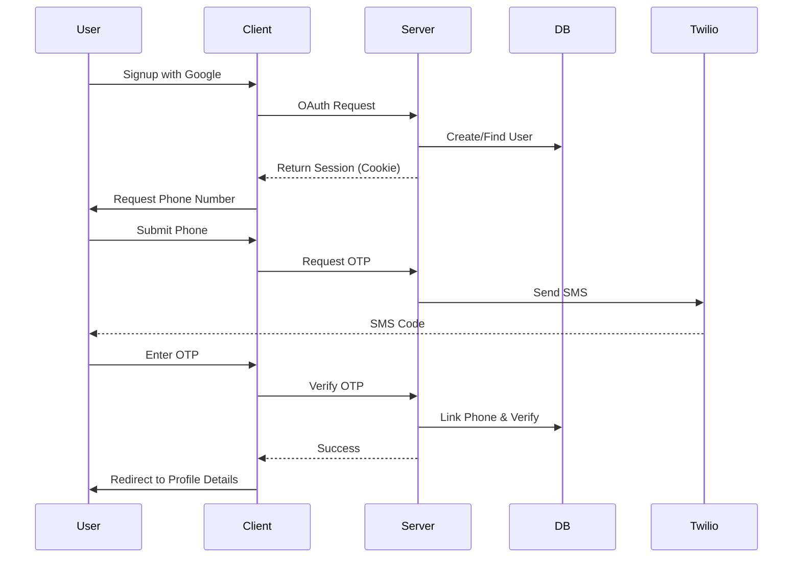
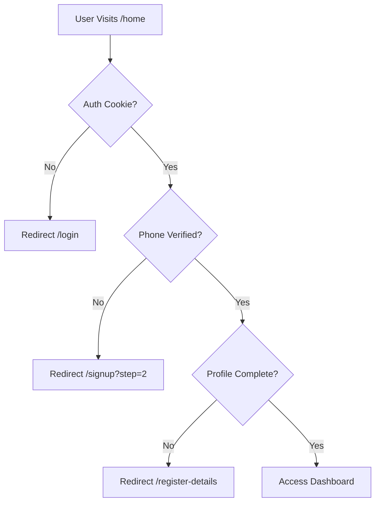

# 📘 Authentication & User Onboarding Documentation

## 1. Overview
This system implements a secure dual-authentication onboarding flow where a user must verify both **Google OAuth** and **Phone OTP** to fully access the application dashboard.

The application ensures:
*   Strong identity verification
*   Secure session handling via cookies
*   Route-level protection using Next.js middleware
*   SMS abuse prevention via rate limiting

## 2. Database Schema (User Model)
**Database**: MongoDB
**ORM**: Mongoose

### User Schema
```json
{
  "_id": "ObjectId",

  "email": "String", 
  "phone": "String",

  "auth_provider": "String", 

  "is_phone_verified": "Boolean",
  "is_profile_complete": "Boolean",

  "username": "String",
  "first_name": "String",
  "last_name": "String",
  "dob": "Date",

  "created_at": "Date",
  "updated_at": "Date"
}
```

### Field Logic
| Field | Description |
| :--- | :--- |
| `email` | Obtained via Google OAuth or manual input |
| `phone` | Mandatory for all users |
| `auth_provider` | `google` or `local` |
| `is_phone_verified` | Must be `true` to access dashboard |
| `is_profile_complete` | Ensures profile setup before access |
| `username` | Auto-generated but user-editable |
| `dob` | Required for profile completion |
| `created_at` | Auto-managed |
| `updated_at` | Auto-managed |

## 3. Technology Stack
| Component | Technology |
| :--- | :--- |
| **Frontend** | Next.js |
| **Backend** | Next.js API Routes |
| **Database** | MongoDB |
| **Auth (Google)** | OAuth 2.0 |
| **Auth (Phone)** | Twilio OTP |
| **Route Protection** | Next.js Middleware |
| **Session Storage** | Secure Cookies |

## 4. Authentication & Onboarding Flow

### A. Signup Flow
1.  User clicks **Signup** on Home Screen
2.  User must complete both:
    *   **Google OAuth Authentication**
    *   **Phone Number OTP Verification**
3.  After verification:
    *   Redirected to `/api/user/register-details`
4.  User enters:
    *   First Name
    *   Last Name
    *   Date of Birth
5.  System auto-generates:
    *   Username (editable)
6.  Profile completion sets:
    *   `is_profile_complete = true`
7.  User redirected to `/home`

### B. Login Flow
1.  User can authenticate using either:
    *   **Google OAuth**
    *   OR
    *   **Phone OTP**
2.  Upon successful authentication:
    *   Redirect to `/home`

## 5. Security Measures

### 5.1 Rate Limiting (OTP Abuse Prevention)
| Rule | Value | Applied To |
| :--- | :--- | :--- |
| **Phone OTP Limit** | 3 requests per phone | Prevent SMS pumping |

### 5.2 Route Protection (Next.js Middleware)
**Rules**:
*   User must be authenticated
*   Phone must be verified
*   Profile must be complete

```javascript
if (!auth || !user.is_phone_verified || !user.is_profile_complete) {
  redirect("/login");
}
```

## 6. Mermaid Diagrams (User Flow)

### Request Flow


### Complete User Authentication Flow


### Route Protection Logic

